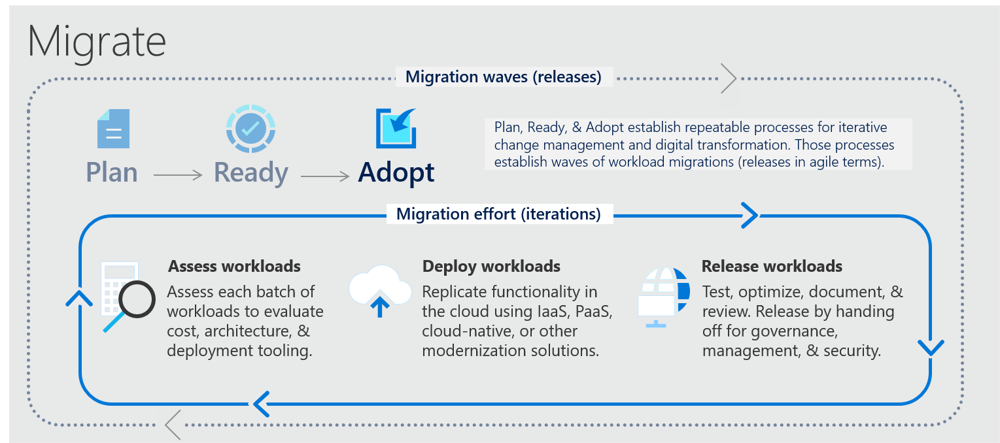

<!--Headings -->

# Microsoft Cloud Adoption Framwork

**Wat is Cloud Adoption Framework?**

Het Cloud Adoption Framework van Microsoft is een raamwerk van best practices en documentatie. Het levert een bijdrage om bedrijven te helpen met de migratie naar de Azure Cloud. Door naar de Cloud over te stappen kunnen klanten, resources on-demand gebruiken zonder een vooraf ondertekende contract. Het nemen van een beslissing om naar de Cloud te migreren is een grote stap. het framework van Microsoft biedt daarbij ondersteuning voor de migratie naar de Cloud. Het framework levert naast de migratie ook ondersteuning op meerdere business units. Zo zijn er richtlijnen voor de strategieën voor bedrijfs-, cultuur-en technische wijzigingen om de gewenste resultaten voor de business te verduidelijken.

**Belangrijke uitgangspunten:**

- Define strategy
- Plan
- Govern
- Manage

Met behulp van de boven genoemde faseringen is de klant zich bewust van de levenscyclus die doorlopen zal moeten worden om het bedrijf zo successvol mogelijk te migreren naar de Cloud.

(2020, 15 mei). Microsoft Cloud-acceptatie raamwerk voor Azure-documentatie - Cloud Adoption Framework. Microsoft Docs. https://docs.microsoft.com/nl-nl/azure/cloud-adoption-framework/overview

# Cloud governance aspecten

**Strategy**

Het definiëren van de bedrijfsstrategie is de eerste stap in het adoptie framework. Om tot een goede strategie te komen is het belangrijk dat er eerst overlegd wordt met belangrijke stakeholders en de leidinggevenden om de achterliggende reden en motivatie te verduidelijken. Hierna volgt het documenteren van de belangrijkste uitgangspunten die hieruit voortvloeien. Wanneer de strategie bekend is kan er een business case worden ontwikkeld. in de business case worden de financiële kosten besproken voor de migratie naar de Cloud. Een handige tool om gebruik van te maken is de TCO calculator. Hiermee kan een on-premise omgeving vergeleken worden met een Cloudomgeving de resultaten hiervan zijn ook zeer lijdend voor de businesscase.

B. (2019, 4 mei). Een strategie voor cloudacceptatie ontwikkelen - Cloud Adoption Framework. Microsoft Docs. https://docs.microsoft.com/nl-nl/azure/cloud-adoption-framework/strategy/

**Plan**

De cloud adoptie plan zet de doelen van de cloud strategieën om in een uitvoerbaar plan. de Cloudteam kan vervolgens het plan gebruiken de technische aspecten sturing te kunnen geven zodat ze goed worden afgestemd op de bedrijfsstrategie. Er moet tijdens de planfase een inventaris gemaakt worden van de assets die gemigreerd dienen te worden.

B. (2019b, mei 4). Plan voor cloudmigratie opstellen - Cloud Adoption Framework. Microsoft Docs. https://docs.microsoft.com/nl-nl/azure/cloud-adoption-framework/plan/

**Preperation**

Alvorens er gemigreerd kan worden naar de Cloud. Is het belangrijk om de AS-IS oftewel de huidige applicaties van de infrastructuur in kaart te brengen. Dit kan een behoorlijke klus zijn omdat je applicaties over de gehele organisatie verspreidt zijn en op verschillende manieren worden gebruikt. schakel daarom collega's van verschillende afdelingen in om een beeld te krijgen van hoe de applicaties interacteren.

De volgende stap is het creëren van een landingzone. Dit zijn de outputvarianten van de Azure Cloud omgeving. voorbeelden van landingzones zijn : iaas, paas en saas. de landingzones maken de migratie naar de Cloud gemakkelijker met inachtneming voor schaalbaarheid, beveiliging en beheer.

B. (2019a, mei 4). Cloudmigratie voorbereiden - Cloud Adoption Framework. Microsoft Docs. https://docs.microsoft.com/nl-nl/azure/cloud-adoption-framework/ready/

**Migration**

Om het migratieproces te starten raad het framework aan om op een iteratieve manier je workload naar de Cloud te migreren. Door gebruik te maken van korte iteraties is kunnen fouten sneller opgemerkt en hersteld worden.

Hieronder is te zien hoe het iteratieve proces van de migratiefase uitziet. En welke bijbehorende subprocessen daarbij belangrijk zijn.

- assess workloads:

  beoordelen van de workloads door te kijken naar de kosten, benodigde tooling en soort architectuur dat gebruikt zal worden in de Cloudomgeving. Ook belangrijk om de dependencies en gebruikerspatronen te achterhalen zodat de workload technisch ook uitgevoerd kan worden.

- deploy workloads:

  Workload wordt daadwerkelijk geimplementeerd in de cloudomgeving in de juiste vooraf bepaalde landingzone (iaas,paas of saas).

- Release workloads

  Nadat de workload is geimplementeerd in een landingzone, kan er getest en geoptimaliseerd worden. Belangrijk hierbij is om de workloads over te dragen aan de governance, operations management, en securityteam voor continu ondersteuning van de workloads in de cloudomgeving.

  B. (2020a, mei 4). Cloudmigratie - Cloud Adoption Framework. Microsoft Docs. https://docs.microsoft.com/nl-nl/azure/cloud-adoption-framework/migrate/

**Governance**

Cloud governance focust zich op een strategische benadering van de langetermijn doelstellingen van een organisatie. Daarbij wordt gekeken naar of de juiste dingen gedaan worden, het op een juiste manier wordt uitgevoerd en hoe we kunnen evalueren dat het ook daadwerkelijk zo is.

Governance is een iteratief proces het veranderd telkens omdat het beleid en de processen van een organisatie ook telkens veranderen. Daarbij is het belangrijk om een goede fundering te voor het beheer van de gehele organisatie. De volgende taken helpen bij het bouwen van een governance foundation:

- methodology: zorg voor de basiskennis en het beheersen hiervan van de Cloud Adoption Framework.

- Benchmark: zorg voor het opstellen van een visie van waar je nu staat en waar je naartoe wilt werken.

- initial governance foundation: maak gebruik van eenvoudige governance tools (mvp).

**Manage**

Om voor te bereiden voor de manage fase van de Cloud Adoption Framework, moeten er een aantal stappen worden doorlopen om dit tot een success te laten lopen.

- inventory

  maak een inventariesatie lijst van de assets die kritiek zijn voor de bedrijfsvoering.

- operational compliance

  Beheren van de configuraties die plaatsvinden door bijvoorbeeld gebruik te maken van version control. Waarbij aanpassingen aan software code bijgehouden kan worden.

- protect and recover

  Maak gebruik van services die ervoor zorgen dat de beschikbaarheid acceptabel is met zo min mogelijke verstoringen. Zorg er ook voor dat je snel kunt herstellen na een verstoring.

# Volledigheid

Het Cloud Adoption Framework is minder volledig als bijvoorbeeld Cobit als het aankomt op Cloud Governance. Het framework is erg praktisch; het is gemaakt om snel te migreren naar de cloud en in kaart te brengen wat hier allemaal bij komt kijken.

# Sterkte/zwakke punten

Het sterkste punt van dit framework is dat het snel in de praktijk inzetbaar is. Bedrijven kunnen dit framework gebruiken om snel hun infrastructuur te migreren naar de Cloud en de nodige aanpassingen te maken om het bedrijf cloud-ready te maken. Om Cloud Governance op te zetten kan dit framework worden gebruikt, maar het is niet zo uitgebreid als bijvoorbeeld Cobit. Het is verstandiger om bij de daadwerkelijke implementatie van Cloud Governance gebruik te maken van Cobit of Opengroup Cloud Governance Framework.

# Gebruik van framework

Azure biedt dit framework aan aan klanten om gebruik van te maken. Klanten kunnen van dit framework gebruik maken om infrastructuur naar de Cloud te migreren.

# Video
https://www.youtube.com/watch?v=3g4JYwxz-cE 

